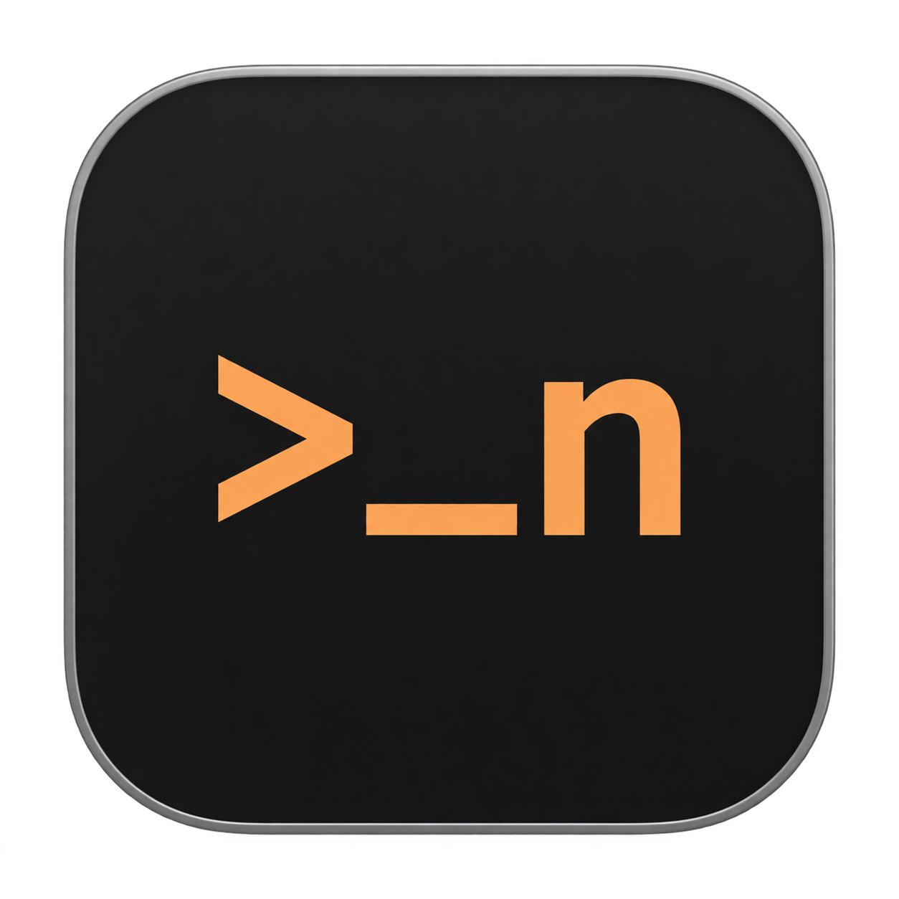

<p align="center">
  
</p>

<h1 align="center">NiumaTerm</h1>

<p align="center">A high performance multi-tab, multi-workspace terminal application.</p>

<p align="center">
  <a href="LICENSE"></a>
  <a href="#windows"></a>
  <a href="#macos"></a>
</p>

## Features

- Feature-rich terminal based on [rioterm](https://github.com/raphamorim/rio)
- High performance VT parser with [libghostty-vt](https://github.com/ghostty-org/ghostty) and [its Rust binding](https://github.com/uzaaft/libghostty-rs)
- GPU-accelerated UI with [Zed editor's GPUI](https://github.com/zed-industries/zed/tree/main/crates/gpui)
- UI components backed by [gpui-component](https://github.com/longbridge/gpui-component)

## Build

Windows and macOS (Apple silicon) are supported.
Install Rust through rustup; the repository's `rust-toolchain.toml` selects the required toolchain.

### Windows

> As libghostty-vt is written in Zig but most people do not have Zig toolchain installed on their machines,
> this repo bundles a prebuilt Windows libghostty.a which is **opt-in** by default. If you don't want to build it by yourself,
> set `NMT_USE_PREBUILT_LIBGHOSTTY` environment variable to `1`.

```powershell
# PowerShell

$env:NMT_USE_PREBUILT_LIBGHOSTTY="1"
cargo run --bin NiumaTerm
```

If you want to build libghostty-vt on your machine:

1. Install Zig toolchain `v0.16.0` (https://ziglang.org/download/) and add zig compiler to your PATH environment variable.
2. Make sure both `llvm-objcopy` and `llvm-nm` are in your PATH environment variable because compiling libghostty-vt requires them. Currently libghostty-vt's Zig simdutf dependency conflicts with rioterm's Rust dependency. This problem will be solved in future version.
3. Perform a normal `cargo run --bin NiumaTerm`.

### macOS

Use an Apple silicon Mac with Xcode and its Metal Toolchain installed. Select the full Xcode installation as the active developer directory. In Xcode, open **Settings → Components** and install **Metal Toolchain** if it is missing.
Install Zig **0.16.0** and add `zig` to your `PATH`. The Windows prebuilt libghostty library cannot be used on macOS.

Build from the repository root, then create an application bundle so macOS can display the app icon and provide application services:

```sh
cargo build --locked
scripts/bundle-macos.sh --profile debug --out target/macos
open target/macos/NiumaTerm.app --args --testing
```

The bundle includes the icon at standard and Retina resolutions and is signed for local use. For an optimized build, use `cargo build --locked --release` and pass `--profile release` to the bundle script. If you set `CARGO_TARGET_DIR`, pass the resulting executable path with `--binary`.

## Development

Setup git hooks before committing anything:

```
git config core.hooksPath .githooks
```

## Code Style

- Insert reasonable blank lines between logic.

## License

Licensed under the [MIT License](LICENSE).
