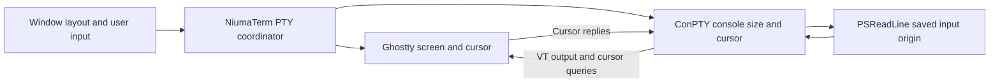

# ConPTY resize and line-editor synchronization

Updated: 2026-09-14. Implementation baseline: `f3562681`.

The branch bundles ConPTY `1.25.260710002-preview` and includes output
preservation, saved startup grids, native write completion, and ordered
input/resize submission. PSReadLine remains unmodified. A default-enabled
[compatibility setting](#application-compatibility-setting) now applies an
80 ms pause after resize to supported sessions. Public redraw handlers remain
experiments. See [current regression results](conpty-realign-input-desync.md#current-regression-results)
for passing coverage and the two unresolved native resize/input cases.

## Assessment

A complete correction must keep three states consistent: the terminal engine's
screen and cursor, ConPTY's console coordinates, and the line editor's saved
input origin. Correcting only one state can leave another inconsistent.
The current NiumaTerm branch fixes several host-side errors, but it does not
yet satisfy this requirement during arbitrary resize and input interleavings.

The version matrix shows that ConPTY 1.25 cursor synchronization and a
PSReadLine coordinate refresh work together in cases where either measure
alone fails. With the installed, unmodified PSReadLine 2.4.5, a public API
refresh passed 30 of 30 basic shrink/grow cases under ConPTY 1.25. The same
refresh failed all 20 wrapped-input cases under ConPTY 1.24. This changes the
interpretation of the earlier public API experiment: its wrapped-input failure
does not establish that the public coordinate calculation itself is unusable.

However, automatically injecting a refresh key is not a complete solution.
An additional native experiment proved that it clears an active selection:
typing `q` after selecting `old_input` produces `old_inputq`, instead of `q`.
Using official PSReadLine 2.3.6 avoids the recently introduced resize-check
suppression, but fails a separate rapid typing/resize regression with duplicated
visible text. Neither workaround should become the default on this evidence.

A later 80 ms delay in the native test driver passed all 45 measured
shrink/grow cases, compared with 23 of 45 immediate-input cases, and preserved
selection replacement in a separate check. This is evidence for a possible
narrow workaround, not a verified production queue or a complete correction.
Its untested editing modes and timing limits are described below. The later
application implementation is described separately from that experiment.

The recommended direction is a coordinated resize design with reliable
producer synchronization and an editor refresh that preserves editing state.
Existing public interfaces do not yet provide a verified, transparent
implementation for every PSReadLine 2.4.5 editing mode. That missing capability
must remain explicit. Shipping a privately modified PSReadLine is outside this
project's accepted scope; an official upstream correction or a fully validated
public integration would meet that scope.

## Scope and evidence

The version-matrix investigation was performed on September 14, 2026 in
`fix/conpty-realign-no-rewrite`, starting from `488c329d1` with the host changes
that are now committed through `f3562681`. Disposable native test executables
loaded different ConPTY pairs from isolated directories beside each executable.
Those comparisons did not replace installed modules or the PowerShell profile.

The dependency upgrade is now committed separately in `b133ae17`; the 1.25
comparison pair is also the branch's bundled pair. Keep the initial 1.24
captures and later 1.25 validation distinct when interpreting the results.

| Component | Version or configuration |
| --- | --- |
| Windows | 10.0.26200.0 |
| PowerShell | 7.6.6 |
| Installed PSReadLine | 2.4.5 |
| Official comparison module | PSReadLine 2.3.6, extracted into the ignored test directory |
| Initial baseline ConPTY pair | File version 1.24.2607.10001 |
| Comparison and now-bundled ConPTY pair | File version 1.25.2607.10002 |
| Comparison package | Microsoft.Windows.Console.ConPTY 1.25.260710002-preview |
| Terminal engine | Existing NiumaTerm prebuilt Ghostty with the repository's patches |
| Initial test grid | 80 columns by 24 rows |

At the investigation date, the official NuGet package index lists
1.24.260710001 as stable and 1.25.260710002-preview as the newer preview.
The PSReadLine release listing still identifies 2.4.5 as its newest release.
An official release's availability is separate from whether it passes this
application's tests. [1](https://www.nuget.org/packages/Microsoft.Windows.Console.ConPTY/)
[2](https://github.com/PowerShell/PSReadLine/releases/tag/v2.4.5)

The experiments below concern the reproducible resize/input displacement.
The original intermittent invisible-input incident has not been captured in a
complete input/output trace. The two symptoms must not be declared identical
without that evidence.

## Coordinate ownership



Ghostty owns the displayed content, wrap metadata, history, and active cursor.
ConPTY maintains the console view queried by Windows applications and converts
application console operations into VT output. PSReadLine separately remembers
where the prompt ended and how its last input rendering occupied the screen.
A correct cursor reply can synchronize the first two without updating the third.

The following distinctions are essential:

| Observation | What it demonstrates | What it does not demonstrate |
| --- | --- | --- |
| New GPUI frame dimensions | Host engine accepted the grid | Shell has observed the change |
| Native input write completed | Bytes reached the OS pipe | PSReadLine processed those keys |
| `ResizePseudoConsole` succeeded | Resize signal was submitted | Editor completed coordinate recovery |
| ConPTY received a cursor reply | Producer can use the host cursor | Editor's cached origin was invalidated |
| Prompt and input look aligned once | That captured rendering was aligned | History, selection, or later editing is correct |

Microsoft's implementation sends resize information through `hSignal`, separate
from the input pipe. `_ResizePseudoConsole` returns the result of that native
write. There is no editor acknowledgment in this call. Consequently, draining
the input writer before sending a resize establishes submission ordering, not
an application-level ordering across both channels.
[3](https://github.com/microsoft/terminal/blob/main/src/winconpty/winconpty.cpp)
[4](https://learn.microsoft.com/en-us/windows/console/resizepseudoconsole)

## Confirmed causes and their limits

### PSReadLine render-state suppression

PSReadLine change #4448 deliberately skips the resize check when the previous
render occurred less than 50 ms earlier. It was introduced to reduce cursor
queries and remote interactive latency, and first shipped in 2.4.1-beta1.
Both 2.4.5 and the upstream rendering code inspected on the investigation
date retained this condition.
[5](https://github.com/PowerShell/PSReadLine/pull/4448)
[6](https://github.com/PowerShell/PSReadLine/blob/v2.4.5/PSReadLine/Render.cs)

The earlier controlled stopwatch experiment is stronger causal evidence than
a timing correlation. It initialized PSReadLine, then changed only the elapsed
time seen by that check before the first insertion. Suppressing the check
produced displacement in 10 of 10 runs for each producer; allowing it produced
no displacement in 10 of 10 runs for each producer. These were empty-input
cases, not a complete wrapped-input or editing-mode evaluation. The method
used private state only for diagnosis and is not a deployment proposal.

In the reproduced failure, the prompt is on row 20 and the later input is
positioned on row 24. The prior ConPTY 1.25 capture already contained a cursor
query and a correct row-20 synchronization before the later row-24 positioning.
Waiting for a cursor reply alone therefore does not resolve this cached-origin
failure. See [the earlier experiment](conpty-resize-psreadline-render-check.md)
for the sequence and preserved logs.

### ConPTY and host reflow can disagree

Microsoft issue #18725 explicitly identifies disagreement between ConPTY's
reflow and the hosting terminal as a source of incorrect console cursor
coordinates. Change #19535 marks the producer cursor uncertain after resize
and queries the terminal when a console screen-buffer information request
needs synchronization. Its implementation waits with a timeout; it is not an
unconditional, epoch-tagged resize-completion event. Change #19620 corrects
cursor-response handling when VT input is enabled.
[7](https://github.com/microsoft/terminal/issues/18725)
[8](https://github.com/microsoft/terminal/pull/19535/files)
[9](https://github.com/microsoft/terminal/pull/19620)

This explains why enabling PSReadLine's coordinate calculation against an
older producer can still fail. A calculation based on a cursor that no longer
corresponds to the displayed character can choose the wrong input origin.
The new producer/version matrix supports this interpretation; it does not
prove that every reflow difference has disappeared.

### Reference terminal behavior

Windows Terminal's `UserResize` reflows the screen and computes the new visible
top using both content position and the prior visible boundary. Rows already
in history remain there. WezTerm similarly has a ConPTY-specific resize path
that preserves history and adds blank rows below instead of pulling history
back into the live region when growing.
[10](https://github.com/microsoft/terminal/blob/main/src/cascadia/TerminalCore/Terminal.cpp)
[11](https://github.com/wezterm/wezterm/blob/main/term/src/screen.rs)

NiumaTerm already includes a Windows grow policy that preserves the cursor's
active row, with a regression in `ghostty/tests.rs`. Reimplementing only that
policy is not a new solution to the remaining bug. Column reflow, wrap metadata,
and cursor correspondence still warrant comparison. This investigation compared
reference source code; it did not run an equivalent automated Windows Terminal
or WezTerm UI scenario.

## Native version matrix

Each basic case starts after 40 numbered history lines and a known initialized
PSReadLine prompt. It optionally types 90 or 240 `x` characters, resizes from
80 by 24 to 60 by 20, waits for the host's smaller grid, requests 100 by 30,
and immediately submits `echo NMT_VISIBLE`. Each combination runs ten times.

The optional synchronization handler uses only public APIs:

```powershell
$inputText = ''
$inputCursor = 0
[Microsoft.PowerShell.PSConsoleReadLine]::GetBufferState([ref]$inputText, [ref]$inputCursor)
[Microsoft.PowerShell.PSConsoleReadLine]::SetCursorPosition($inputCursor)
```

It is invoked by an isolated F12 binding immediately before the new input.
`SetCursorPosition` accepts an input-buffer offset, not a screen row.
[12](https://github.com/PowerShell/PSReadLine/blob/v2.4.5/PSReadLine/PublicAPI.cs)

A passing case requires the full expected text immediately before the cursor,
one prompt, the exact number of existing `x` characters, and exactly one copy
of each of the 40 history markers in a full terminal checkpoint. The test waits
100 ms after observing the new text before taking its final sample. That wait
is after input submission and is not an input-delay workaround.

| ConPTY | PSReadLine | Public refresh | Empty input | 90 existing characters | 240 existing characters |
| --- | --- | --- | --- | --- | --- |
| 1.24 | 2.4.5 | No | 2/10 | 0/10 | 0/10 |
| 1.24 | 2.4.5 | Yes | 10/10 | 0/10 | 0/10 |
| 1.25 preview | 2.4.5 | No | 3/10 | 3/10 | 5/10 |
| 1.25 preview | 2.4.5 | Yes | 10/10 | 10/10 | 10/10 |
| 1.24 | Official 2.3.6 | No | 10/10 | 0/10 | 0/10 |
| 1.24 | Official 2.3.6 | Yes | 10/10 | 0/10 | 0/10 |
| 1.25 preview | Official 2.3.6 | No | 10/10 | 10/10 | 10/10 |
| 1.25 preview | Official 2.3.6 | Yes | 10/10 | 10/10 | 10/10 |

These are observed pass counts, not probability estimates. The producer batches
ran concurrently, and timing-sensitive rates can change with scheduling.
All 240 basic cases completed; a failing matrix executable reports failure
after collecting its cases rather than stopping at the first displacement.

The initial 2.3.6 attempts failed during module import because PowerShell had
already loaded another version. Those attempts are excluded from the matrix.
The completed runs selected an isolated module directory through the child
environment's `PSModulePath` before shell startup and checked the loaded module
version. No global installation was replaced.

### Additional editing cases

With ConPTY 1.25 and PSReadLine 2.4.5, the public refresh also passed 15 of 15
cases returning to the original 80-by-24 dimensions, and 15 of 15 cases with
the cursor moved into the middle of existing input. Each group covers input
lengths 0, 90, and 240 with five repetitions. The latter preparation includes
a 100 ms pause after cursor movement, so it is not evidence for a sub-50-ms
mid-edit race.

Official 2.3.6 with ConPTY 1.25 passed all 30 additional cases combining
middle-of-input placement and return to the original size, with and without
the public refresh. These results narrow the candidate mechanisms but do not
establish general editing compatibility.

### A refresh key changes selection semantics

A separate Windows-edit-mode test selects `old_input` with Ctrl+A and types
`q`. Without an extra key, the result is `NMT> q`. With the public F12 refresh
inserted first, the result is `NMT> old_inputq`. No resize is needed to expose
this regression.

PSReadLine's input loop clears a visual selection when a completed key handler
does not continue the selection operation. The same loop also resets several
completion and history-search counters. The selection effect is experimentally
confirmed; the wider mode risks follow from source inspection and need their
own tests. A future refresh must preserve the meaning of the actual next key.
[13](https://github.com/PowerShell/PSReadLine/blob/v2.4.5/PSReadLine/ReadLine.cs)

### An official older module is not a complete fallback

The ordinary native regression
`per_keystroke_typing_during_resize_keeps_complete_input` submits 30 individual
characters at each of four changing sizes. With official 2.3.6 it failed under
both ConPTY 1.24 and 1.25: the final screen contained more visible characters
than the expected 120. Under 1.25, three other ordinary native tests passed,
including history preservation and list prediction after startup resize.

A separate run of that rapid-input test with installed 2.4.5 and ConPTY 1.25
passed. This does not establish a universal version regression rate, but the
2.3.6 failures are sufficient to reject a default downgrade as the complete
solution. Their exact causal path has not been isolated and must not be
attributed to the 50 ms condition without further evidence.

## Candidate remedies

| Candidate | Assessment |
| --- | --- |
| Rewrite cursor-positioning output | Reject. It changes the meaning of application output and cannot restore editor state. |
| Inject scroll-up/down recovery | Reject. Earlier real-engine regressions demonstrated lost content and displaced later output. |
| Delay input by a fixed 50 or 100 ms | Possible mitigation, not completion evidence. The timer is not tied to the last editor render or producer processing. |
| Coalesce every resize during a drag | Useful only within unexecuted adjacent resize requests. Crossing intervening input changes ordering. |
| Preserve the saved startup grid | Keep. It removes an avoidable startup transition, but does not address live editing. |
| Drain native writes before resizing | Keep. It corrects submission ordering, but does not acknowledge child consumption. |
| Upgrade to ConPTY 1.25 alone | Already bundled. Insufficient in the native matrix; the native displacement reproducers remain unresolved. |
| Call `InvokePrompt()` automatically | Reject current proposals. Earlier probes duplicated prompts or overwrote history. |
| Inject a public same-offset refresh key | Promising coordinate probe under 1.25; fails selection preservation and is not transparent. |
| Refresh through `PowerShell.OnIdle` | Not a general solution. It waits for idle and is not generated for nonempty input buffers. |
| Pin official PSReadLine 2.3.6 | Diagnostic comparison only for now. A separate rapid-input test fails. |
| Modify private PSReadLine fields at runtime | Excluded. Private implementation dependencies are not an acceptable deployment technique. |
| Ship a private PSReadLine source correction | Outside the accepted project scope. |
| Adopt an official upstream editor correction | Preferred durable dependency path once a release passes the complete regression suite. |

Microsoft documents the 300 ms idle behavior and the nonempty-buffer restriction.
An idle callback therefore cannot provide the required synchronization before
immediate input into an existing wrapped command.
[14](https://learn.microsoft.com/en-us/powershell/module/microsoft.powershell.utility/register-engineevent?view=powershell-7.5)

## Optional host-side input delay

For a narrower host-side compatibility measure, a follow-up experiment delayed
user input by 80 ms after submitting the final resize. The native PTY session
continued reading output and answering cursor queries during this interval.
It used ConPTY 1.25.2607.10002 and the installed PSReadLine 2.4.5, with no public
refresh key or private editor-state changes in the tested path.

| Scenario | Immediate input | Input delayed by 80 ms |
| --- | --- | --- |
| 80 by 24 to 60 by 20 to 100 by 30; input lengths 0, 90, 240; ten repetitions each | 16/30 passed | 30/30 passed |
| 80 by 24 to 60 by 20 to 80 by 24; input lengths 0, 90, 240; five repetitions each | 7/15 passed | 15/15 passed |

The same complete-input, cursor, prompt-count, and 40-history-marker checks
were used as in the version matrix. The variation between these immediate-input
counts and the earlier counts reflects timing sensitivity. An additional
selection replacement test passed both with and without the delay: selecting
`old_input` before resize and typing `q` afterwards produced `NMT> q`.

This supports an optional input-delay workaround for the specific
shrink/grow/immediate-input scenario. It does not establish that 80 ms always
exceeds the age of the editor's last render: earlier queued input, asynchronous
output, scheduling delays, and ongoing geometry changes can invalidate that
assumption. Completion menus, continued typing during a drag, and long-running
output were not tested by this follow-up.

A production implementation would retain actual user input in order, use a
nonblocking deadline in the PTY coordinator, and allow generated terminal
replies to continue without that delay. It would also bound queue latency,
handle shutdown immediately, and restrict activation to explicitly supported
PowerShell sessions. A timeout fallback would preserve responsiveness while
weakening the workaround's protection; it would not count as synchronization
confirmation. Coalescing resize requests across intervening input remains
inappropriate for the existing ordered submission behavior.

The experiment delayed submission from the native test driver. It did not
install a production queue or validate its wakeups, cancellation, and timeout
handling. Probe source and logs are retained under the ignored research
directory as `resize_delay_probe.rs`, `delay-basic-v125-ps245.txt`,
`delay-return-v125-ps245.txt`, `delay-selection-v125-ps245.txt`, and
`delay-summary.json`. The temporary Cargo test source was removed afterwards.

## Application compatibility setting

Settings > Terminal > Advanced contains **Improve PowerShell compatibility**,
enabled by default. The persisted value is
`[terminal] improve-powershell-compatibility = true`. Existing configuration
files without this value also enable it. Changes apply to existing sessions;
disabling the setting removes the active pause and releases queued input.

Activation requires a locally launched Windows executable named pwsh,
pwsh.exe, powershell, or powershell.exe, including absolute paths and mixed
case. Remote sessions and other launch executables do not activate it. A
nested PowerShell launched inside another shell is not detected. Programs on
the alternate screen bypass the pause. Other programs running inside a
PowerShell session can still encounter the brief pause after resize.

After a changed grid is submitted to the native PTY, the coordinator starts
an 80 ms deadline. It holds user input in the existing command order, while
continuing output reads and generated terminal replies. Output does not extend
the deadline. Resizes cannot overtake intervening input, and only adjacent
unexecuted resizes coalesce. Repeating the same grid does not restart the pause.
The poll timeout wakes a quiet session when input is due; no UI frame is needed.

Each input also receives a 250 ms limit at coordinator receipt. A long sequence
of interleaved input and resize requests can therefore exhaust that input's
artificial waiting budget and release it before a later 80 ms pause expires.
This fallback preserves responsiveness at the cost of reduced protection.
It does not bound time spent in native calls or existing I/O backpressure.
Shutdown is handled during channel draining without waiting for the pause.

The enabled native regression covers initial input lengths 0, 90, and 240,
shrinking from 80 by 24 to 60 by 20 and growing to 80 or 100 columns by 30 rows.
It checks complete input before the cursor, one prompt, exact character counts,
and each of the 40 history markers once. Separate coordinator tests cover idle
deadline wakeup, reply delivery, disabling, shutdown, alternate-screen bypass,
unchanged grids, and the fixed waiting limit. The original unmitigated native
reproducers retain their ignored status and assertions.

These checks exercise the implemented heuristic. They do not turn elapsed
time into an editor readiness signal or establish a complete resize fix.

On 2026-09-14, five consecutive runs of the enabled six-scenario native test
passed all 30 scenarios with tracing disabled. The configuration suite passed
44 tests, the terminal suite passed 187 unit tests and four enabled native
tests, and the settings/pane settings suites passed 32 tests. The original
three opt-in native tests remained ignored in the regular run.

## Requirements for a complete design

The following describes the required behavior, not an already implemented
protocol or a capability exposed by the current resize API.

1. **Track requested and applied grids separately.** Layout requests do not
   become proof of producer or editor readiness. Resize submission failures
   must reach the caller instead of appearing as successful application.
2. **Use one PTY coordinator.** Preserve accepted input order, merge only
   adjacent unexecuted resizes, and keep output reads and terminal replies
   moving throughout any wait. Cancellation and process exit must release it.
3. **Establish producer/engine agreement.** Use the producer's real cursor
   query and maintain compatible reflow behavior. Avoid acknowledging old
   output against a newer geometry without identifying that transition.
4. **Validate the editor's origin before its next rendering.** A refresh must
   run where the current editing operation can safely observe the new size
   and cursor, without introducing an extra logical command or discarding
   selection, completion, history search, numeric arguments, or vi state.
5. **Handle further resizes explicitly.** If geometry changes again during
   validation, repeat against the newest accepted state. A generation number
   helps reject stale observations, but a host-only number cannot identify an
   untagged producer reply or prove that the shell processed anything.
6. **Bound failure behavior.** Unsupported integration, missing replies,
   shell replacement, or a running full-screen program must not leave input
   blocked indefinitely or receive synthetic editor commands.

The host currently cannot infer the full PSReadLine editing state from VT
output alone. Its prompt markers and a correctly drawn cursor do not expose
the module's saved origin or command counters. Introducing an acknowledgment
message is useful only if a supported editor integration can truthfully emit
it after completing the relevant operation.

For current PSReadLine, wrapping the real input action inside one registered
handler could avoid the extra-key selection failure for that action. Extending
this to all printable characters, user-defined bindings, multi-key chords,
prediction, nested completion loops, and vi modes is a substantially larger
compatibility change. No general implementation of that approach was built or
verified here. It should not be represented as a simple production fix.

The clean upstream correction would make the editor validate resize-sensitive
state independently of elapsed time and preserve editing semantics when
handling a geometry transition. Removing one time check is a candidate change,
not proof that mid-render resize and every reflow case are handled. NiumaTerm
can consume an official corrected release without maintaining modified editor
source. No such verified release was identified in this investigation.

## Remaining implementation and validation work

Retain the committed host fixes and the bundled ConPTY 1.25 preview. Keep both
native displacement reproducers visible as unresolved tests. Neither the
version matrix nor individual passing native runs justify marking them fixed.
Do not reintroduce output transformations to change their displayed result.

Add a correlated resize/input trace and run the same scripted scenario against
a reference terminal using the same shell and producer versions. This is the
largest remaining diagnostic gap. It separates engine reflow differences from
producer/editor behavior and should precede another broad host-side workaround.
Repeat dependency comparisons with the same editing cases when evaluating a
future ConPTY or PSReadLine release.

Choose an editor compatibility mechanism only after it passes the
editing-state tests. The preferred durable path is an official corrected
PSReadLine release. A public integration is acceptable only if it preserves
the actual command's semantics across the supported modes. The experimental
F12 handler and the 2.3.6 module are not suitable defaults.

With an unchanged 2.4.5 module, all existing editing behavior, and arbitrary
immediate resize/input timing as simultaneous requirements, this investigation
has not established a complete transparent fix. This is a limit of the current
evidence and available verified integration, not a proof that no host-side
technique could ever work.

## Trace requirements

Use one monotonic clock and record session identity. Normal diagnostic records
can contain lengths, positions, and hashes; full input/output bytes should remain
explicitly enabled because they can include commands and terminal content.

| Record | Required fields |
| --- | --- |
| Session start | OS, shell, loaded module path/version, actual producer path/version, initial grid |
| Resize request | Request sequence, old applied grid, requested grid, timestamp |
| Engine resize | Begin/end, active cursor, visible boundary, history length, wrap state near input |
| Native resize | Begin/end, dimensions, HRESULT |
| Input | Logical event sequence, user input versus terminal reply, queued length, native write completion |
| Output | Ordered raw chunks, timestamp, engine geometry used while parsing |
| Cursor query/reply | Raw sequence, active cursor used in reply, outstanding request context |
| Editor probe | Public input-buffer offset and console size/cursor at an explicitly controlled handler |
| Final check | Complete content checkpoint, expected input, cursor, history marker counts |

The existing `NMT_VT_TRACE` captures raw producer output and engine snapshots.
It does not supply the entire timeline above. Synchronous trace I/O can change
timing, so every candidate must also pass with tracing disabled. Diagnostic
editor probes themselves alter timing and must be compared with uninstrumented
runs. Private-field instrumentation remains a causal experiment only.

## Acceptance criteria

The release gate must cover more than a visible prompt. At minimum, validate
the following with the supported shell/module/producer combinations:

- Restored startup dimensions, changed font or monitor, splits, and hidden panes.
- Empty input, long wrapped input, actual newline-containing input, Unicode and
  wide characters, a cursor in the middle, and input longer than the viewport.
- Shrink/grow, return to identical dimensions, sustained drag, maximize/restore,
  rapid keystrokes, paste, and output arriving during a resize.
- Selection replacement, completion menus, inline/list prediction, history
  search, undo/redo, custom bindings, and Windows/Emacs/vi editing modes.
- History preservation, exactly-once visible input, correct editing at the
  displayed cursor, and correct command text when accepted.
- Full-screen applications, alternate screens, remote shells, process exit,
  resize errors, absent replies, and shutdown during synchronization.

For timing-sensitive native scenarios, use repeated runs with varied submission
timing, both traced and untraced. Unit tests should reproduce queue and failure
handling, while native tests exercise the producer and editor. A unit test that
sets a simulated acknowledgment cannot demonstrate that an external component
actually emits it. A reference-terminal UI comparison and full GUI resize
validation remain outstanding.

## Evidence files

All disposable evidence is under the ignored
`target/conpty-cpr-probe/research/` directory in this worktree. The temporary
integration test was removed from `crates/terminal/tests` after the experiments.

| File | Content |
| --- | --- |
| `resize_research_probe.rs` | Reusable native matrix and selection probe source |
| `matrix-summary.json` | Observed counts grouped by version, refresh, and input length |
| `matrix-v124-ps245.txt`, `matrix-v125-ps245.txt` | Installed-module basic matrix |
| `matrix-v124-ps236-loaded.txt`, `matrix-v125-ps236-loaded.txt` | Successfully initialized official-module matrix |
| `middle-v125-ps245.txt`, `return-old-v125-ps245.txt` | Additional cursor and geometry cases |
| `middle-return-v125-ps236.txt` | Combined middle-input/return-size cases |
| `selection.txt` | Confirmed selection loss caused by an extra refresh key |
| `typing-v125-ps236.txt`, `rapid-v124-ps236.txt` | Rapid-input failures with the official older module |
| `rapid-v125-ps245.txt` | Single passing rapid-input comparison with installed 2.4.5 |
| `pr19535-files.json`, `pr19620-files.json` | Upstream producer changes used in the analysis |

For replay, temporarily copy the probe into `crates/terminal/tests`, build the
`resize_research_probe` test target, and place its executable beside the selected
ConPTY pair. Invoke `resize_version_matrix --exact --nocapture`.
`NMT_PROBE_REPEATS`, `NMT_PROBE_MIDDLE`, and `NMT_PROBE_RETURN_OLD` select the
additional cases. Selecting 2.3.6 also requires the isolated module directory
at the beginning of the child `PSModulePath` before shell startup and
`NMT_PROBE_MODULE` pointing to its manifest. The normal application is not
launched by these test executables. Any later NiumaTerm UI launch must include
`--testing`.

| Download or binary | SHA-256 |
| --- | --- |
| ConPTY 1.24 DLL | `39FBA2713E2495117B1591AE8C32A3B904BEA7AA66069CF7815E2844C76D75D8` |
| ConPTY 1.25 DLL | `E2FE87E2258C4E46FFC5157F727218CC25F34A174902F72EB8A5B49EDD9A6458` |
| Official PSReadLine 2.3.6 package | `B05DCD2E85569F0F941BE028E5ACAF715824B8CE0CED2A25AA8B2BD775247683` |

## Sources

All online sources were checked on September 14, 2026. Source branches named
`main` or `master` can subsequently change; downloaded copies of the central
files and relevant PR changes are retained with the local evidence.

1. Microsoft Terminal. [ConPTY NuGet package and version list](https://www.nuget.org/packages/Microsoft.Windows.Console.ConPTY/). Packages dated July 13, 2026.
2. PowerShell. [PSReadLine 2.4.5 release](https://github.com/PowerShell/PSReadLine/releases/tag/v2.4.5). October 22, 2025.
3. Microsoft Terminal. [`winconpty.cpp`](https://github.com/microsoft/terminal/blob/main/src/winconpty/winconpty.cpp), `_ResizePseudoConsole`.
4. Microsoft Learn. [ResizePseudoConsole](https://learn.microsoft.com/en-us/windows/console/resizepseudoconsole).
5. PowerShell, Dongbo Wang. [PSReadLine #4448](https://github.com/PowerShell/PSReadLine/pull/4448). Merged February 4, 2025.
6. PowerShell. [PSReadLine 2.4.5 Render.cs](https://github.com/PowerShell/PSReadLine/blob/v2.4.5/PSReadLine/Render.cs). Compared with [2.3.6](https://github.com/PowerShell/PSReadLine/blob/v2.3.6/PSReadLine/Render.cs) and current upstream source.
7. Microsoft Terminal, Leonard Hecker. [Issue #18725](https://github.com/microsoft/terminal/issues/18725). Opened March 26, 2025.
8. Microsoft Terminal. [PR #19535 changes](https://github.com/microsoft/terminal/pull/19535/files). Merged November 18, 2025.
9. Microsoft Terminal. [PR #19620](https://github.com/microsoft/terminal/pull/19620). Merged December 5, 2025.
10. Microsoft Terminal. [`Terminal::UserResize`](https://github.com/microsoft/terminal/blob/main/src/cascadia/TerminalCore/Terminal.cpp).
11. WezTerm. [`Screen::resize`](https://github.com/wezterm/wezterm/blob/main/term/src/screen.rs).
12. PowerShell. [PSReadLine 2.4.5 public buffer and cursor APIs](https://github.com/PowerShell/PSReadLine/blob/v2.4.5/PSReadLine/PublicAPI.cs).
13. PowerShell. [PSReadLine 2.4.5 ReadLine.cs](https://github.com/PowerShell/PSReadLine/blob/v2.4.5/PSReadLine/ReadLine.cs), input-loop state cleanup.
14. Microsoft Learn. [Register-EngineEvent](https://learn.microsoft.com/en-us/powershell/module/microsoft.powershell.utility/register-engineevent?view=powershell-7.5), idle behavior.
15. PowerShell. [Official PSReadLine 2.3.6 package](https://www.powershellgallery.com/packages/PSReadLine/2.3.6) and [release](https://github.com/PowerShell/PSReadLine/releases/tag/v2.3.6). Used without source changes.
